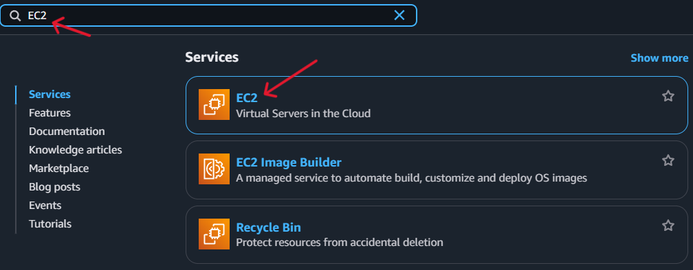
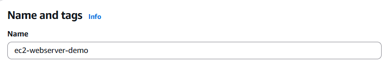
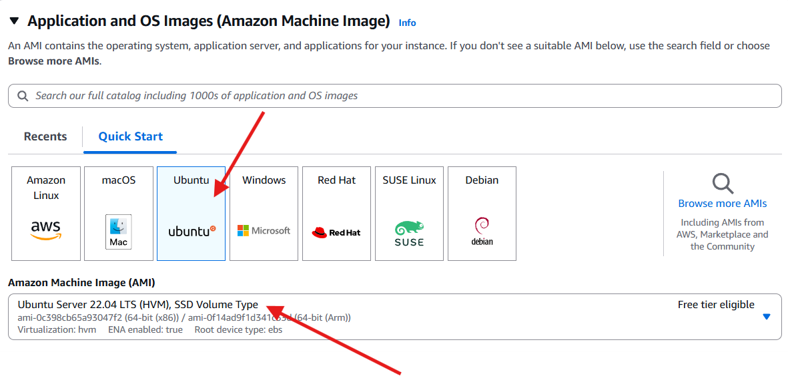
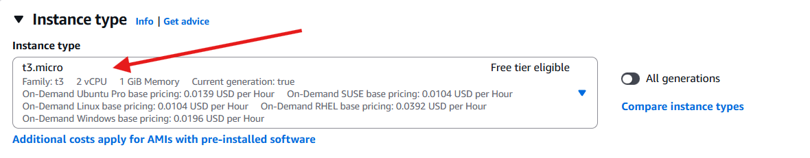
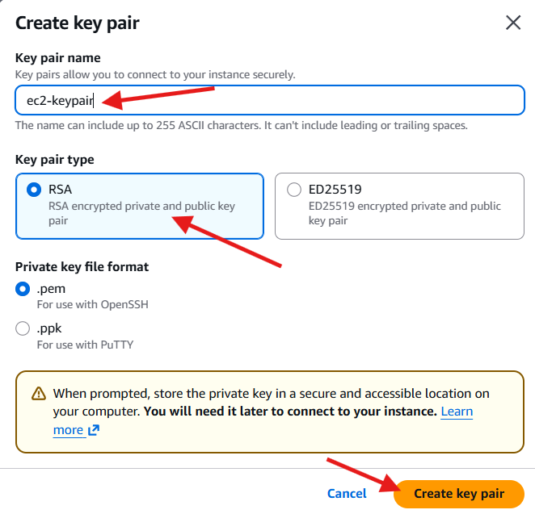
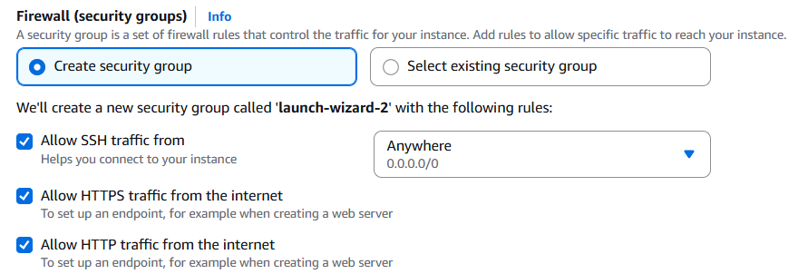
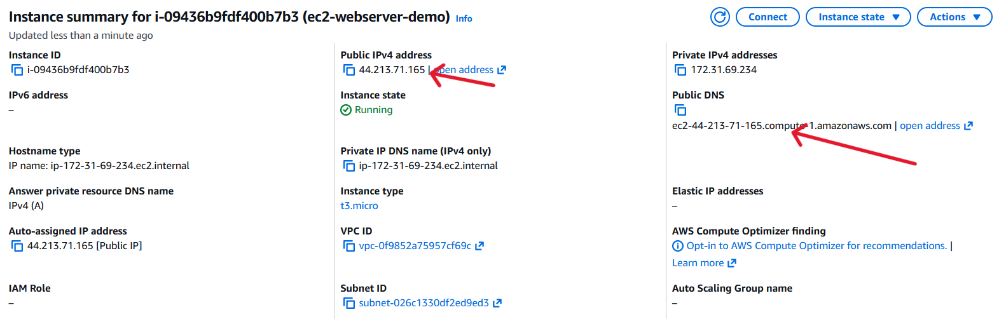
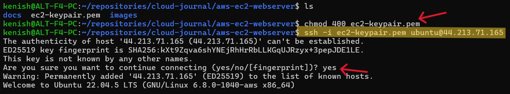
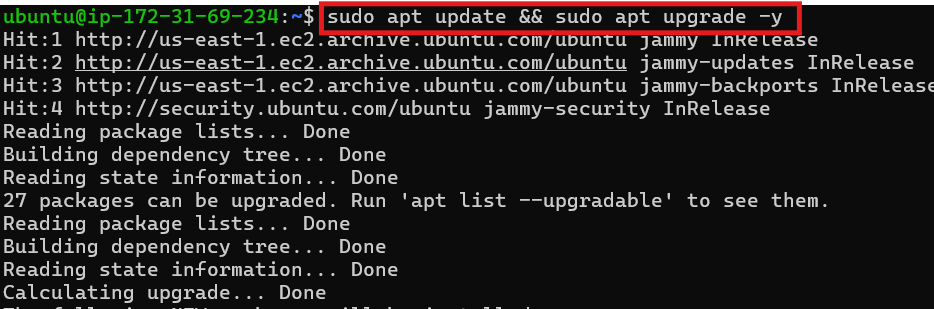
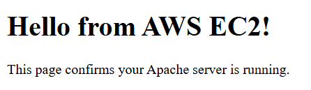

## Step 1 - Launch an EC2 Instance

1. Log in to **AWS Console**
2. Search for **EC2** → open it

---
3. Click **Launch instance**
4. Enter a name: `ec2-webserver-demo`

---
5. Select AMI: `Ubuntu Server 22.04 LTS (Free Tier Eligible)`

---
6. Choose Instance Type: `t3.micro`

---
7. Create a **Key Pair**:
- Name: `ec2-keypair`
- Type: RSA
- Download the `.pem` file

---
8. Configure the Security Group

---
9. Launch the instance
10. EC2 Instance successfully launched

    Here check important details about EC2 instance:
    - Instance state: Running
    - Public IPv4 address: 44.213.71.165 (used for SSH access)    

    This confirms that the EC2 server is active and ready for SSH connection.

---
 ## Step 2 - Connect to the EC2 Instance

1. On Linux/macOS/WSL:

    chmod 400 ec2-keypair.pem
    ssh -i ec2-keypair.pem ubuntu@PUBLIC-IP
---

2. On Windows (PowerShell):
        
        ssh -i .\ec2-keypair.pem ubuntu@PUBLIC-IP
        
        **NOTE** -i in the ssh command means “use this identity file (private key)"
---
## Step 3 - Update Server Packages

This makes sure your server is secure, stable and up-to-date from day one.

---
## Step 4 - Install Apache Web Server

    sudo apt install apache2 -y
    sudo systemctl start apache2
    sudo systemctl enable apache2
    sudo systemctl status apache2

    **NOTE** Apache is used because it’s a reliable, beginner-friendly and highly compatible web server for hosting websites and applications.

---

## Step 5 - Deploy a Simple Web Page
Replace default Apache index page: `/var/www/html/index.html`

    <!DOCTYPE html>
    <html>
    <head>
    <title>AWS EC2 Web Server</title>
    </head>
    <body>
    <h1>Hello from AWS EC2!</h1>
    
This page confirms your Apache server is running.

    </body>
    </html>

---
## Step 6 - Test the Deployment
1. Copy EC2 Public IPv4 address.
2. Paste it into your browser.

---

